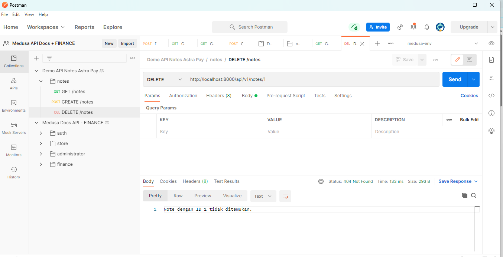

### Running Backend
- Clone https://github.com/adoel90/astrapay-spring-boot-external
- import as Maven Project
- Start Main `AstrapayBaseExternal`

### Running FE
- Clone https://github.com/adoel90/angular-astrapay-note-app
- `npm install` (Pastikan node version-nya adalah v6.9.0)
- `npm start`

### PREVIEW

*Gambar 1:  sebelum mengisi form*

*Gambar 2:  setelah eksekusi melewati validasi*

*Gambar 3:  API POST create note*

*Gambar 4:  API GET list note*

*Gambar 4:  API DELETE note, but not found*

*Gambar 5:  API DELETE note, successfully*

*Gambar 6:  UI shows 6 notes*